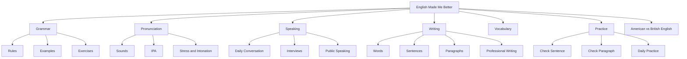

# English Made Me Better

English Made Me Better is a practical learning system for improving English communication, confidence, clarity of thought, and public speaking.

The repo uses simple tools: Markdown lessons, Mermaid diagrams, JSON practice data, and small Python scripts. There is no web app, no database, and no heavy framework.

## Mission

Build one complete place where I can learn, practice, correct, and track English from beginner to advanced level.

The learning method is simple:

1. Break English into first principles: sounds -> letters -> words -> phrases -> sentences -> paragraphs -> conversations -> professional communication.
2. Use the Feynman Technique: explain every topic simply, practice it, correct mistakes, and teach it back in my own words.

## Who This Repo Is For

- Learners who want clear English without confusion.
- Indian speakers who want to reduce common grammar and pronunciation mistakes.
- Software engineers who need better worknotes, emails, interviews, meetings, and technical explanations.
- Anyone who wants to speak with more confidence and write with more clarity.

## What I Will Learn

- Grammar from first principles.
- Pronunciation, English sounds, IPA basics, stress, rhythm, and intonation.
- American and British English differences.
- Vocabulary for daily life, interviews, and professional work.
- Sentence, paragraph, email, worknote, and ticket-update writing.
- Speaking practice for daily conversation, interviews, meetings, and public speaking.
- Grammar correction and professional rewriting using Python scripts.

## Repo Map



## Repo Structure

```text
grammar/                 Grammar lessons from beginner to advanced
pronunciation/           Sounds, IPA, stress, rhythm, and accent notes
speaking/                Conversation, interviews, meetings, public speaking
writing/                 Words, sentences, paragraphs, emails, worknotes
vocabulary/              Daily, professional, interview, and tech words
american-vs-british/     Spelling, vocabulary, grammar, pronunciation
practice/                Practice sets and answer keys
data/                    JSON question banks and drill data
scripts/                 Simple Python checking and practice tools
diagrams/                Mermaid learning maps
tests/                   Basic tests for Python scripts
```

## How To Use This Repo Daily

1. Open `DAILY-PRACTICE.md`.
2. Pick the 30-minute, 60-minute, or 120-minute plan.
3. Study one small lesson.
4. Complete one practice set.
5. Check one sentence or paragraph with Python.
6. Record mistakes in `ROADMAP.md`.
7. Explain the topic back in simple words.

## 30-Minute Daily Plan

- 5 min pronunciation
- 10 min grammar
- 5 min vocabulary
- 5 min sentence practice
- 5 min speaking

## 60-Minute Daily Plan

- 10 min pronunciation
- 15 min grammar
- 10 min vocabulary
- 10 min writing
- 10 min speaking
- 5 min review

## 90-Day Roadmap

- Days 1-30: sounds, basic grammar, simple sentences, daily speaking.
- Days 31-60: tenses, clauses, paragraphs, pronunciation drills, professional vocabulary.
- Days 61-90: interviews, public speaking, technical explanations, professional communication.

See `STUDY-PLAN-90-DAYS.md` for the full plan.

## How To Practice Grammar

1. Read one lesson in `grammar/`.
2. Write 5 examples.
3. Fix the common mistakes from the lesson.
4. Complete questions from `practice/grammar-practice.md`.
5. Teach the rule back in your own words.

## How To Practice Pronunciation

1. Study one sound or stress pattern from `pronunciation/`.
2. Read the example words aloud.
3. Record your voice.
4. Compare American and British notes when useful.
5. Repeat the drill slowly, then naturally.

## How To Practice Speaking

1. Pick one prompt from `practice/speaking-practice.md`.
2. Speak for 60 seconds.
3. Listen to your recording.
4. Note unclear words, grammar errors, and hesitation.
5. Repeat the same answer more clearly.

## How To Check Sentences Using Python

```bash
python scripts/check_sentence.py "He do not knows about this issue"
```

You can also check a paragraph:

```bash
python scripts/check_paragraph.py "Today morning I completed it. Please revert back."
```

Generate daily practice:

```bash
python scripts/generate_daily_practice.py
```

## Progress Tracking Method

Use `ROADMAP.md`.

Track:

- Date
- Grammar topic
- Pronunciation drill
- Speaking prompt
- Writing practice
- Mistakes found
- Improvement

The goal is not perfection. The goal is visible improvement every week.

## Future Improvements

- Add more original practice questions.
- Add weekly speaking scripts.
- Add more professional email and worknote examples.
- Add more tests for the Python checkers.
- Add personal mistake logs from real writing and speaking practice.
