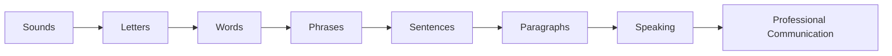

# English Learning Map

```mermaid
flowchart LR
    A[Sounds] --> B[Letters]
    B --> C[Words]
    C --> D[Phrases]
    D --> E[Sentences]
    E --> F[Paragraphs]
    F --> G[Speaking]
    G --> H[Professional Communication]
```
