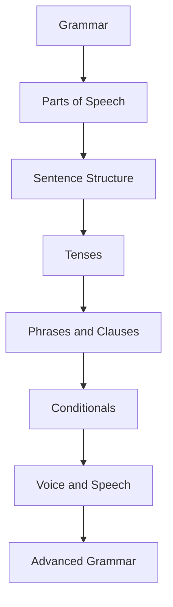

# Grammar Map

```mermaid
flowchart TD
    A[Grammar] --> B[Parts of Speech]
    B --> C[Sentence Structure]
    C --> D[Tenses]
    D --> E[Phrases and Clauses]
    E --> F[Conditionals]
    F --> G[Voice and Speech]
    G --> H[Advanced Grammar]
```
