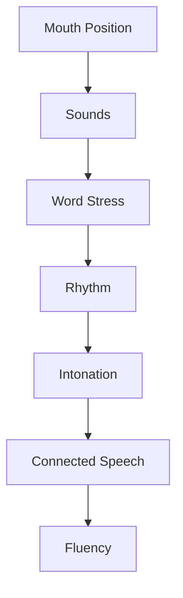

# Pronunciation Map

```mermaid
flowchart TD
    A[Mouth Position] --> B[Sounds]
    B --> C[Word Stress]
    C --> D[Rhythm]
    D --> E[Intonation]
    E --> F[Connected Speech]
    F --> G[Fluency]
```
